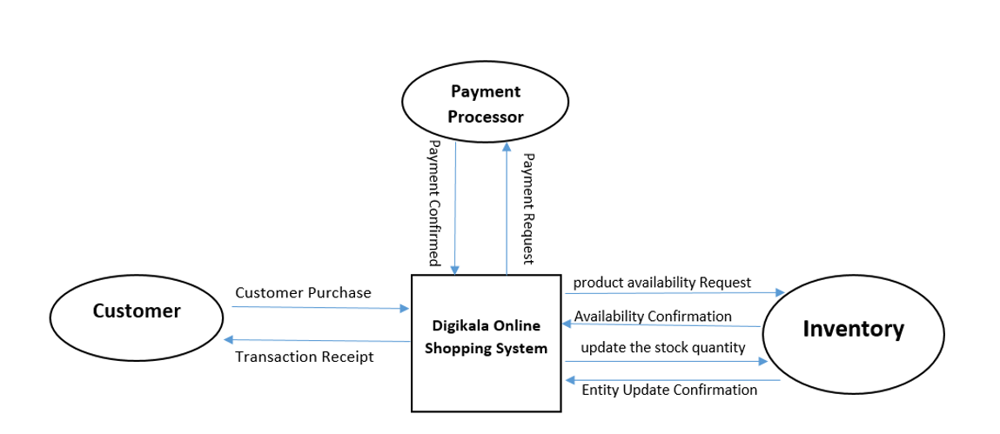
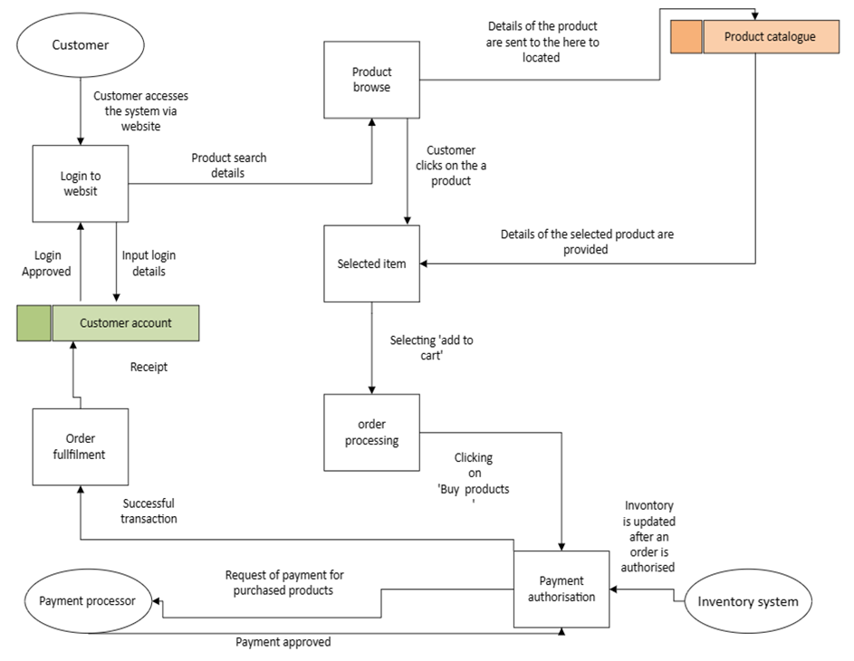
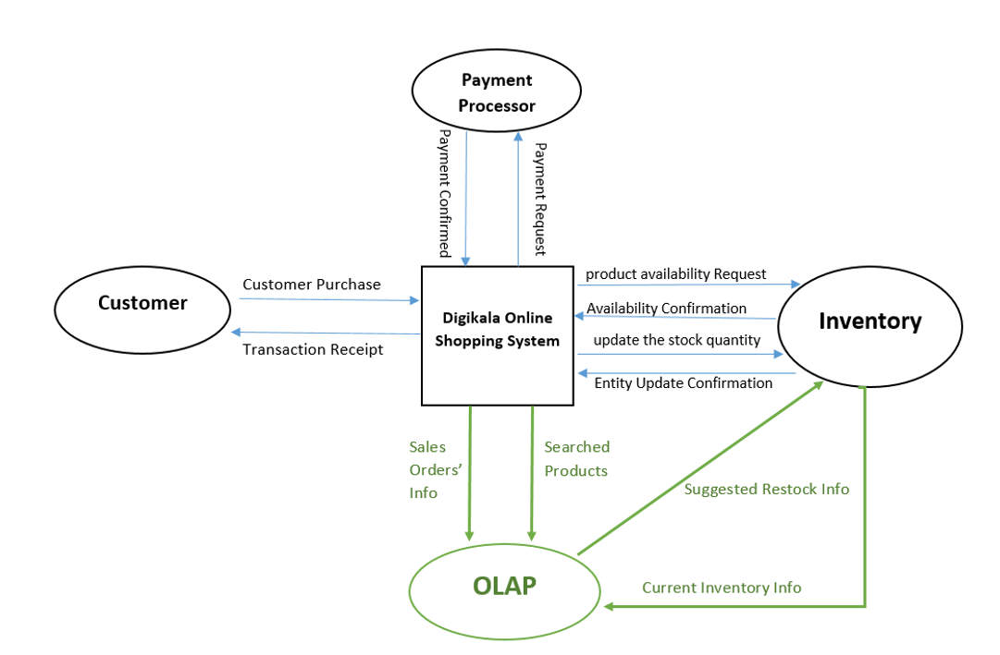
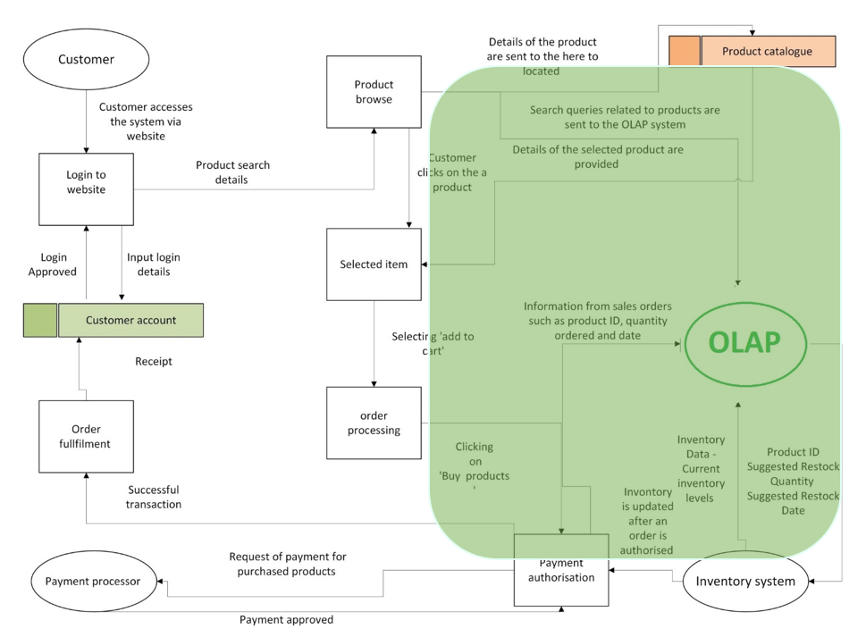
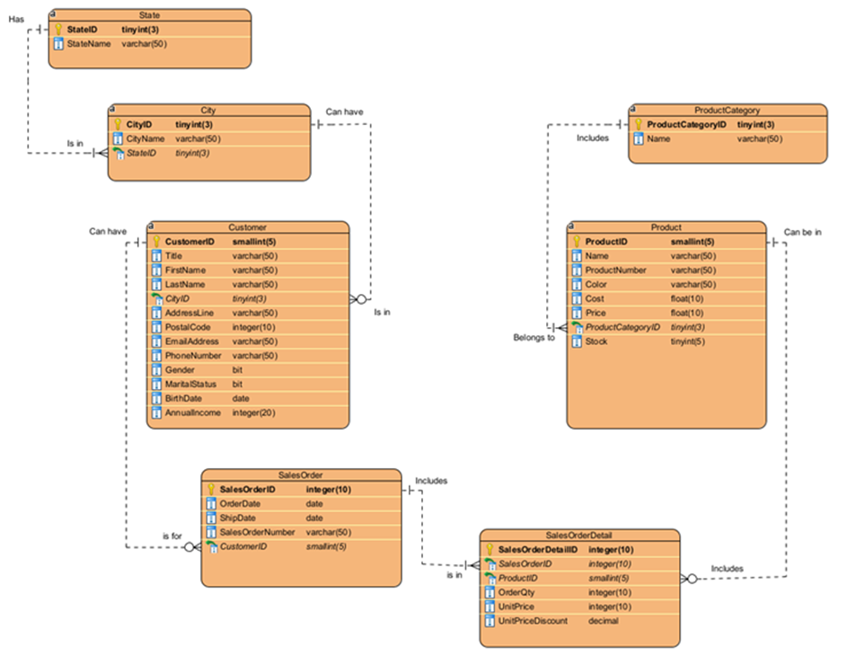

# Digikala Data Management Evaluation and SQL Prototypehttps

## ✔️Overview
This project critically evaluates the data management practices of Digikala, a leading online shopping platform, and proposes solutions to improve its operations. The project focuses on optimising data flow and enhancing inventory management by integrating an OLAP system for real-time analytics. A Data Flow Diagram (DFD) and an Entity-Relationship Diagram (ERD) were created to represent the current and proposed systems. Additionally, a fully implemented SQL-based prototype was built, including 8 queries to generate strategic reports and insights.

## ✔️Main Report
The complete evaluation and analysis are available in the detailed report here: [Digikala Data Management Report.pdf].

## ✔️Problem Statement
Digikala faces challenges in managing inventory during high-demand periods and promotional events. To address this, the project recommends implementing an OLAP system to forecast demand and adjust inventory levels dynamically. This will enable Digikala to:

- Monitor customer behaviour
- Improve inventory replenishment
- Optimise supply chain operations

## ✔️Key Components

### 1. Data Management Practices
The project evaluates various aspects of Digikala’s data management, such as:

- **Data Integration**: Consolidating customer, product, and sales data for streamlined processes.
- **Data Interoperability**: Ensuring seamless data exchange between the online shopping platform and the inventory system.
- **Data Flow Optimisation**: Implementing automated, real-time analytics to proactively manage inventory.

### 2. Data Flow Diagrams (DFD)
- **Context Diagram (As Is)**: Shows how Digikala currently handles customer interactions, payment processing, and inventory management.
   

- **Level 0 DFD (As Is)**: Visualises the data flow for key processes like order fulfilment, payment processing, and inventory updates.

   
- **Context Diagram (To Be)**: Introduces an OLAP system to enable better inventory forecasting.
      

- **Level 0 DFD (To Be)**: Displays how real-time analytics will provide restocking recommendations to improve inventory management.
      

   
### 3. Entity-Relationship Diagram (ERD)
- The ERD details the relationships between key entities like customers, products, sales orders, and inventory. This design supports efficient queries for data analysis and reporting.
     

### 4. SQL-Based Prototype
The SQL build implements the ERD, featuring all the necessary tables and sample data. Additionally, the following 8 queries were designed to generate valuable reports and insights:
  - **Query 1:** Analyse the effect of discounts on quantity sold.
  - **Query 2:** Analyse Customer Lifetime Value (CLTV) Segmentation by Demographics.
  - **Query 3:** Perform Customer Demography Analysis to identify effective segments for acquiring new customers.
  - **Query 4:** Analyse Delivery Lead Time and City Profitability Trends.
  - **Query 5:** Identify products with Low Stock Levels but High Demand from High-Value Customers.
  - **Query 6:** Identify At-Risk Customers and Customer Churn.
  - **Query 7:** Identify Top 2 Best-Selling Products in each Product Category.
  - **Query 8:** Track Sales Trends Over Time (Monthly).

### ✔️Datasets
The datasets used in this project include information on cities, customers, products, product categories, sales orders, and states.  
- **City.csv:** Contains data about cities, including city names and corresponding state information.  
- **Customer.csv:** Contains customer demographic information such as customer ID, name, and contact details.
- **Product.csv:** Lists product attributes, including product ID, name, description, price, and current stock.
- **ProductCategory.csv:** Contains product category information, linking products to their respective categories.
- **SalesOrder.csv:** Includes high-level details about customer sales orders, such as order ID, customer ID, and order date.
- **SalesOrderDetail.csv:** Contains detailed information for each product in a sales order, including product ID, quantity, unit price, and discount applied.
- **State.csv:** Lists state information, including state names and unique state identifiers.

